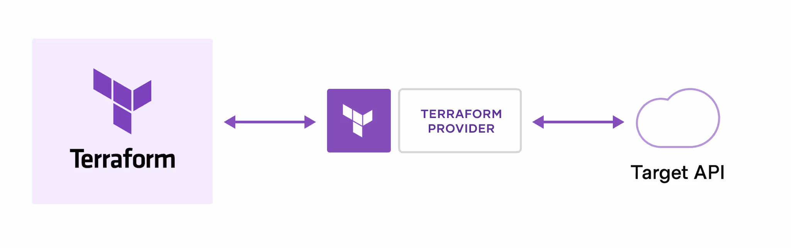
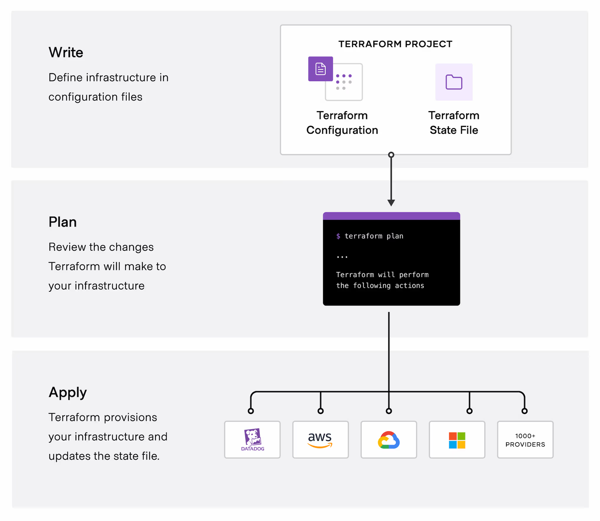

# Terraform

## What is Terraform?
Terraform is an infrastructure as code tool that lets us build, change, and version cloud and on-prem resources safely and efficiently.

## How does Terraform work?
Terraform creates and manages resources on cloud platforms and other services through their application programming interfaces (APIs). Providers enable Terraform to work with virtually any platform or service with an accessible API.

#### The core Terraform workflow consists of three stages:
- Write
    - We define resources, which may be across multiple cloud provider and services.
- Plan
    - Terraform creates an execution plan describing the infrastructure it will create, update, or destroy based on the existing infrastructure and our configuration.
- Apply
    - On approval, Terraform performs the proposed operations in the correct order, respecting any resource dependencies.

## Why Terraform?
1. Manage any infrastructure
2. Track our infrastructure
3. Monitor our infrastructure
4. Automate changes
5. Standardize configuration
7. Large Community

